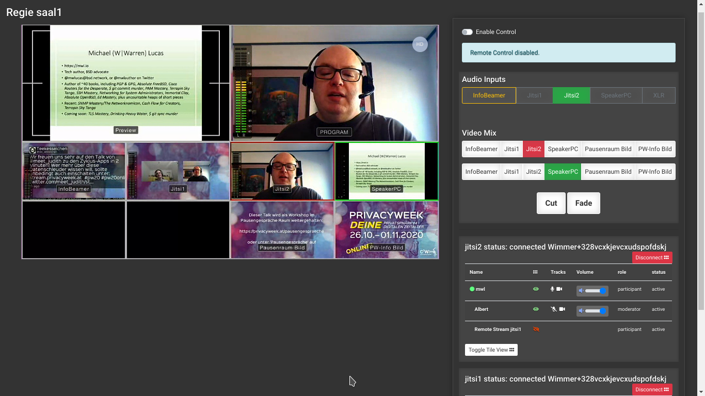

# RemoteStudio

This is a simple approach for a fully remote controlled multi-user video solution based
on an Atem videomixer and jitsi-meet as low-latency (multiview) video transport and conference solution.

it consists of:
* centralized webinterface for remote studio control, multi-user
* 'worker' clients
  * atem videomixer control
  * Jitsi "head-only" display-client as 'virtual cameras'

## Jitsi client
The main of this project is a remote-controlled Jitsi display client based on the Jibri project with currently the following featureset:
* jitsi room joining via Studio Web UI
* multiple Jitsi display clients per Studio room
* hidden Jitsi UI Elements, optional tileview background
* display Jitsi participants and their state+tracks and audio activity in Studio UI
* Studio Controls:
  * switch fullscreen/tileview
  * pin participants in fullscreen
  * dynamically hide participants in tile view
  * mute and control volume of participants

Please note that this should be considered a PoC and not a finished product.

# protocol ideas

## rooms and registration
  * for now room names are not fixed
  * users and workers join their channels by sending a `join` command with `room` and `type` arguments.
  * `type` may be one of `user`, `worker`
  * client type is saved in the `session['type']` to use the same websocket interface
  * main room of a client is saved in `session['room']`
### users

room for messages to user: `<room>_user`

### workers

room for messages to workers: `<room>_worker`

workers do have an ID, but all messages inside a room are transmitted to all workers
